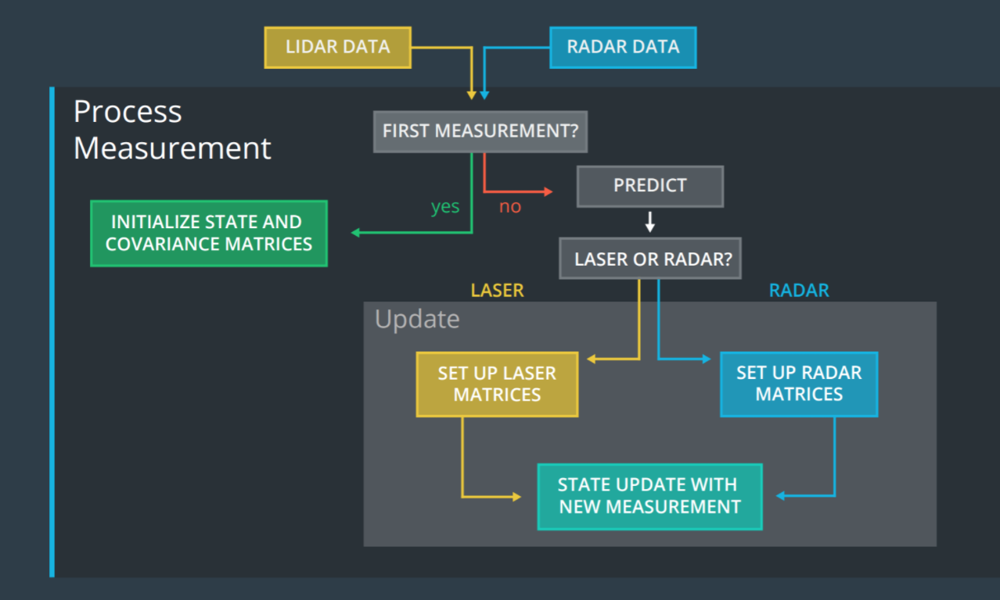

# Capstone Project for C++ Specialization #

[1. Overview](#1-menu)<br>
[2. Instructions to install](#2-menu)<br>
[2.1. uWebSocketIO Starter Guide](#2-1-menu)<br>
[3. Other Important Dependencies](#3-menu)<br>
[4. Basic Build Instructions](#4-menu)<br>
[5. The EKF Design](#5-menu)<br>
[6. Applying OOP](#6-menu)<br>
[7. Protocol Commnication](#7-menu)<br>

## 1. Overview <a id="1-menu"></a>

This project make use of an Extended Kalman Filter (EKF) to estimate the state of a moving object of interest with noisy LIDAR and RADAR measurements to detect a bicycle that travels around a vehicle. The project uses an Extended Kalman Filter, fusion of LIDAR measurements, RADAR measurements to track the bicycle's position and velocity.
The final project can be seen [here](https://youtu.be/0uBDKslP_js).

The figure shows the complete trajectory of vehicle.


The figure shows how the predicted values are close to ground truth values.


The figure shows details of image above.


---

## 2. Instructions to install <a id="2-menu"></a>

The first step is to download the simulator that will simulate the lidar and radar sensors sending measurements that are processed by the EKF algorithm. The simulator can be download from [here](https://github.com/udacity/self-driving-car-sim/releases/).

This repository includes two files that can be used to set up and install [uWebSocketIO](https://github.com/uWebSockets/uWebSockets) for either Linux or Mac systems. For windows you can use either Docker, VMware, or even [Windows 10 Bash on Ubuntu](https://www.howtogeek.com/249966/how-to-install-and-use-the-linux-bash-shell-on-windows-10/) to install uWebSocketIO. 

### 2.1. uWebSocketIO Starter Guide <a id="2-1-menu"></a>

This project involve using an open source package called [uWebSocketIO](https://github.com/uNetworking/uWebSockets). This package facilitates the connection between the simulator and the C++ code. The package does this by setting up a web socket server connection from the C++ program to the simulator, which acts as the host. In the project repository there are two scripts for installing `uWebSocketIO` - one for Linux and the other for macOS.

Note: Only uWebSocketIO branch e94b6e1, which the scripts reference, is compatible with the package installation.

**Linux Installation:**

From the project repository directory run the script: `install-ubuntu.sh`

**Mac Installation:**

From the project repository directory run the script: `install-mac.sh`

Some users report needing to use `cmakepatch.txt` which is automatically referenced and is also located in the project repository directory.

**Windows Installation**

Although it is possible to install uWebSocketIO to native Windows, the process is quite involved. Instead, you can use one of several Linux-like environments on Windows to install and run the package.

**Bash on Windows**

One of the newest features to Windows 10 users is an Ubuntu Bash environment that works great and is easy to setup and use. Here is a nice [step by step guide](https://www.howtogeek.com/249966/how-to-install-and-use-the-linux-bash-shell-on-windows-10/) for setting up the utility.

I recommend using the version of Ubuntu Bash 16.04 or 18.0, which is able to run the `install-ubuntu.sh` script without complications. The link [here](https://www.howtogeek.com/278152/how-to-update-the-windows-bash-shell/) can help you check which version of Ubuntu Bash you are running, and also help you upgrade if you need to.

**Docker**

If you don't want to use Bash on Windows, or you don't have Windows 10, then you can use a virtual machine to run a Docker image that already contains all the project dependencies.

First [install Docker Toolbox for Windows](https://docs.docker.com/toolbox/toolbox_install_windows/).

Next, launch the Docker Quickstart Terminal. The default Linux virtual environment should load up. You can test that Docker is setup correctly by running `docker version` and `docker ps`.

You can enter a Docker image that has all the project dependencies by running:

```
docker run -it -p 4567:4567 -v 'pwd':/workspace/controls_kit:latest
```

Once inside Docker you can clone over the GitHub project repositories and run the project from there.

**Port forwarding is required when running code on VM and simulator on host**

For security reasons, the VM does not automatically open port forwarding, so you need to manually enable port 4567. This is needed for the C++ program to successfully connect to the host simulator.

Port Forwarding Instructions:

1. First open up Oracle VM VirtualBox
2. Click on the default session and select settings.
3. Click on Network, and then Advanced.
4. Click on Port Forwarding
5. Click on the green plus, adds new port forwarding rule.
6. Add a rule that assigns 4567 as both the host port and guest Port.

---

## 3. Other Important Dependencies <a id="3-menu"></a>

* cmake >= 3.5
  * All OSes: [click here for installation instructions](https://cmake.org/install/)
* make >= 4.1 (Linux, Mac), 3.81 (Windows)
  * Linux: make is installed by default on most Linux distros
  * Mac: [install Xcode command line tools to get make](https://developer.apple.com/xcode/features/)
  * Windows: [Click here for installation instructions](http://gnuwin32.sourceforge.net/packages/make.htm)
* gcc/g++ >= 5.4
  * Linux: gcc / g++ is installed by default on most Linux distros
  * Mac: same deal as make - [install Xcode command line tools](https://developer.apple.com/xcode/features/)
  * Windows: recommend using [MinGW](http://www.mingw.org/)

---

## 4. Basic Build Instructions <a id="4-menu"></a>

1. Clone this repo.
2. Make a build directory: `mkdir build && cd build`
3. Compile: `cmake .. && make` 
   * On windows, you may need to run: `cmake .. -G "Unix Makefiles" && make`
4. Run it: `./ExtendedKF `

This repository has a `Makefile` and the instructions above you can simply replace by the following commands:

1. make clean
2. make build
3. cd build
4. ./ExtendedKF

---

## 5. The EKF design <a id="5-menu"></a>

How the Extended Kalman Filter algorithm works?

Imagine you are in a car equipped with sensors on the outside. The car sensors can detect objects moving around: for example, the sensors might detect a pedestrian, or even a bicycle. Lets consider the Kalman Filter algorithm using the bicycle example.

The Kalman Filter algorithm will go through the following steps:

- **first measurement** - the filter will receive initial measurements of the bicycle's position relative to the car. These measurements will come from a radar or lidar sensor.
- **initialize state and covariance matrices** - the filter will initialize the bicycle's position based on the first measurement.
- then the car will receive another sensor measurement after a time period Δt.
- **predict** - the algorithm will predict where the bicycle will be after time Δt. One basic way to predict the bicycle location after Δt is to assume the bicycle's velocity is constant; thus the bicycle will have moved velocity * Δt.
- **update** - the filter compares the "predicted" location with what the sensor measurement says. The predicted location and the measured location are combined to give an updated location. The Kalman filter will put more weight on either the predicted location or the measured location depending on the uncertainty of each value.
- then the car will receive another sensor measurement after a time period Δt. The algorithm then does another **predict** and **update** step.

---
## 6. Applying OOP <a id="6-menu"></a>

This project apply OOP best practices where possible, which facilitates the understand and future updates. Below is a list of more common OOP features used. The project uses the C++14 or higher, as defined in CMakeLists.txt file.

- Project structure:
  * **directories**<br>
    `src`: store the source files *.cpp, *.hpp, *.h<br>
    `data`: store the Eigen library<br>
    `images`: store image files<br>
    `.vscode`: store files used by VS code debugger<br>
  * **files**<br>
    main.cpp, FusionEKF.cpp(.h), kalman_filter.cpp(.h), tools.cpp(.h), measurement_package.h, json.hpp<br>
  * **input/output**<br>
    the algorithm reads data from the input file `obj_pose-laser-radar-synthetic-input.txt`, located in data directory and write the output (optional) to `obj_pose-laser-radar-synthetic-output.txt` in the same directory. 
  * **classes**<br>
    `FusionEKF` defined in FusionEKF.h<br>
    `KalmanFilter` defined in kalman_filter.h<br>
    `MeasurementPackage` defined in measurement_package.h<br>
    `Tools` defined in tools.h<br>
  * **class member initializer**<br>
     used class member list initialization in `MeasurementPackage` class. The class object is instantiated in main.cpp file, where both LASER and RADAR object sensors are created.<br>
  * **class member access**<br>
    When appropriate, the classes are using **public** and/or **private** access to class members as we can see in `FusionEKF`, for instance.<br>
  * **encapsulation**<br>
    `FusionEKF` class encapsulates all the matrices used to process the fusion of both LASER and RADAR measurements.<br>
    `KalmanFilter` class encapsulates the matrices members and methods used to process the behavior of EKF algorithm during the object tracking.
  * **smart pointer**<br>
    using `unique_ptr` in main.cpp file.
  * **parameter as reference**<br>
    because the algorithm behavior is changing in time, all the parameters used in methods of `KalmanFilter` are passed as reference.<br>

- Source Files:

The project uses the following source files located in the `src` directory: main.cpp, FusionEKF.cpp, FusionEKF.h, kalman_filter.cpp, kalman_filter.h, tools.cpp, tools.h, measurement_package.h, json.hpp.

---
## 7. Protocol Communication <a id="7-menu"></a>

Here is the main protocol that main.cpp uses for uWebSocketIO in communicating with the simulator.

**INPUT**: values provided by the simulator to the c++ program

["sensor_measurement"] => the measurement that the simulator observed (either lidar or radar)

**OUTPUT**: values provided by the c++ program to the simulator

["estimate_x"] <= kalman filter estimated position x<br>
["estimate_y"] <= kalman filter estimated position y<br>
["rmse_x"]<br>
["rmse_y"]<br>
["rmse_vx"]<br>
["rmse_vy"]<br>
